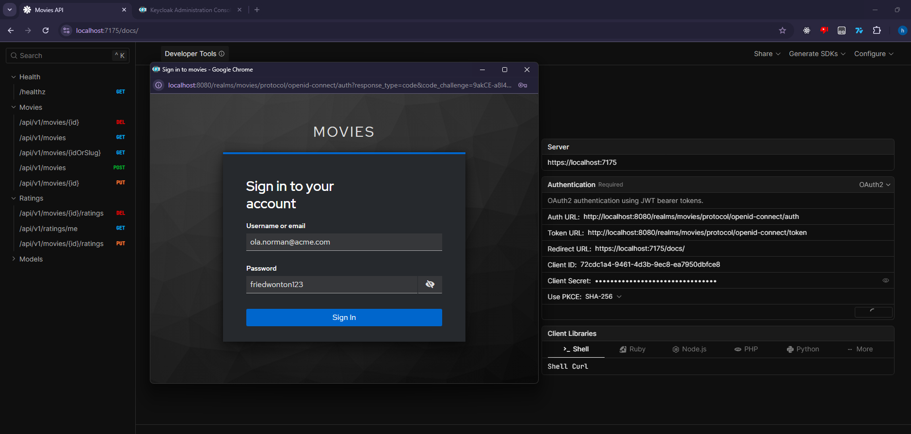
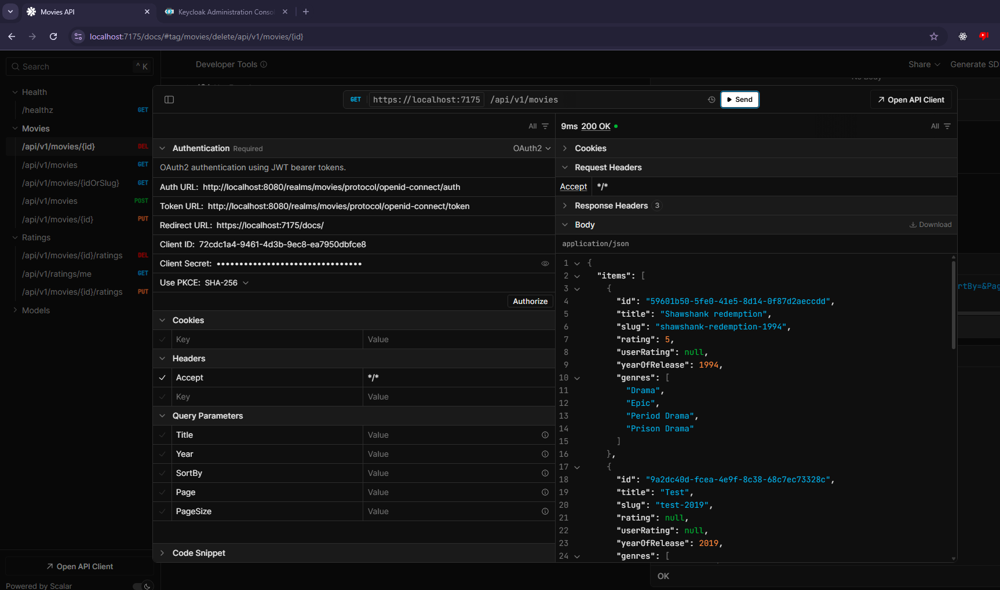
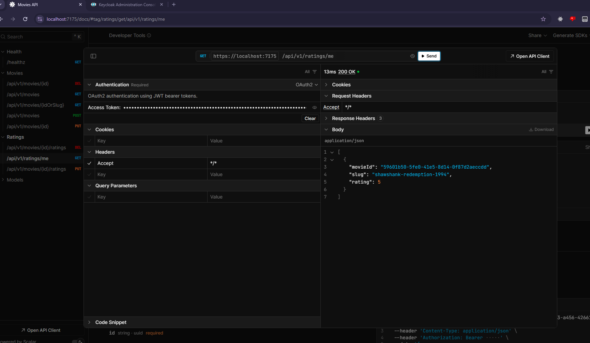

# Movies.Api - RESTful Movie Management API

A simple and modern RESTful API for managing movies and ratings built with .NET 10, PostgreSQL, and Keycloak authentication.

## Table of Contents
- [Tech Stack](#tech-stack)
- [Features](#features)
- [Architecture](#architecture)
- [Getting Started](#getting-started)
- [API Endpoints](#api-endpoints)
- [Authentication & Authorization](#authentication--authorization)
- [Database Schema](#database-schema)
- [Configuration](#configuration)
- [Development](#development)

## Tech Stack

- **.NET 10.0**
- **PostgreSQL 18** - Primary database with Npgsql provider
- **Dapper** - Lightweight ORM for data access
- **Keycloak 26.4** - OAuth2/OIDC authentication and authorization
- **Scalar** - Modern interactive API documentation
- **FluentValidation** - Strongly-typed validation rules
- **Docker Compose** - Container orchestration for local development
- **Bruno** - Additional HTTP Client that consumes the API

## Features

### Movie Management
- ✅ Create, read, update, and delete movies
- ✅ Retrieve movies by ID or URL-friendly slug
- ✅ Paginated movie listings (configurable 1-20 items per page)
- ✅ Filter movies by title and year of release
- ✅ Sort movies by multiple fields (ascending/descending)
- ✅ Automatic slug generation from movie titles

### Rating System
- ⭐ Rate movies on a 1-5 scale
- ⭐ View average movie ratings
- ⭐ Personalized ratings for authenticated users
- ⭐ Retrieve all ratings made by a user
- ⭐ Delete user ratings

### Caching
- 🚀 Output caching middleware with 1-minute cache policy
- 🚀 Query parameter-based cache variation
- 🚀 Automatic cache invalidation on write operations

### API Documentation
- 📚 Interactive OpenAPI documentation via Scalar UI
- 📚 OAuth2 integration in Scalar for testing authenticated endpoints
- 📚 Accessible at `/docs` endpoint

## Architecture

The solution follows a layered architecture with clear separation of concerns:

```
Movies.Api/              # Presentation Layer
├── Controllers/V1/      # API endpoint controllers
├── Mapping/             # Request/response mapping
├── Health/              # Health check implementation
└── Program.cs          # Application startup

Movies.Application/      # Application Layer
├── Auth/                # Authentication/authorization logic
├── Database/            # Database connection and initialization
├── Model/               # Domain models
├── Repositories/        # Data access layer
├── Services/            # Business logic services
├── Validators/          # FluentValidation validators
└── Extensions/          # DI configuration

Movies.Contracts/        # Contract Layer
├── Requests/            # API request DTOs
└── Responses/           # API response DTOs
```

### Design Patterns
- **Repository Pattern** - Abstraction over data access
- **Service Layer Pattern** - Business logic encapsulation
- **Dependency Injection** - Loose coupling and testability
- **Factory Pattern** - Database connection factory
- **Mapper Pattern** - Request/response transformation

## Getting Started

### Prerequisites
- .NET 10.0 SDK
- Docker & Docker Compose
- PostgreSQL client (optional, for manual database access)

### Setup

1. **Clone the repository**
   ```bash
   git clone <repository-url>
   cd Movies.Api
   ```

2. **Configure secrets**

   Set up the following configuration in `appsettings.Development.json` or user secrets:

   ```json
   {
     "ConnectionStrings": {
       "Database": "Host=localhost;Port=5432;Database=movies;Username=postgres;Password=postgres"
     },
     "Authentication": {
       "Issuer": "http://localhost:8080/realms/movies",
       "Audience": "23201409-99f1-4ffb-a804-edbf9fcd5868"
     },
     "Jwt": {
       "ClientId": "23201409-99f1-4ffb-a804-edbf9fcd5868",
       "AuthorizationURL": "http://localhost:8080/realms/movies/protocol/openid-connect/auth",
       "AccessTokenURL": "http://localhost:8080/realms/movies/protocol/openid-connect/token"
     },
     "Scalar": {
       "ClientId": "72cdc1a4-9461-4d3b-9ec8-ea7950dbfce8",
       "ClientSecret": "<scalar-client-secret>"
     }
   }
   ```

3. **Start infrastructure services**
   ```bash
   docker compose up -d
   ```

   This starts:
   - PostgreSQL on port 5432
   - Keycloak on port 8080

4. **Configure Keycloak (one-time setup)**

   Access Keycloak at http://localhost:8080:
   - Login with admin credentials
   - Create a realm named `movies`
   - Create clients with the IDs specified in configuration
   - Configure client roles (add `write` role for admin users)
   - Set up redirect URIs and enable Authorization Code flow with PKCE

5. **Run the API**
   ```bash
   dotnet run --project Movies.Api
   ```

   Or start via your IDE (Visual Studio / Rider)

6. **Access the API documentation**

   Navigate to https://localhost:7175/docs

## API Endpoints

### Base URL
```
https://localhost:7175/api/v1
```

### Movies

| Method | Endpoint | Description | Auth Required | Role Required |
|--------|----------|-------------|---------------|---------------|
| POST | `/movies` | Create a new movie | ✅ | write |
| GET | `/movies/{idOrSlug}` | Get movie by ID or slug | ❌ | - |
| GET | `/movies` | Get paginated list of movies | ❌ | - |
| PUT | `/movies/{id}` | Update movie | ✅ | write |
| DELETE | `/movies/{id}` | Delete movie | ✅ | write |

**Query Parameters for GET /movies:**
- `title` - Filter by movie title (partial match)
- `year` - Filter by year of release
- `sortBy` - Field to sort by (e.g., "title", "yearOfRelease")
- `page` - Page number (default: 1)
- `pageSize` - Items per page (1-20, default: 10)

### Ratings

| Method | Endpoint | Description | Auth Required |
|--------|----------|-------------|---------------|
| PUT | `/movies/{id}/ratings` | Rate a movie (1-5) | ✅ |
| DELETE | `/movies/{id}/ratings` | Delete user's rating | ✅ |
| GET | `/ratings/me` | Get all ratings by authenticated user | ✅ |

### Health

| Method | Endpoint | Description |
|--------|----------|-------------|
| GET | `/healthz` | API and database health check |

## Authentication & Authorization

### Authentication Flow
The API uses **OAuth2/OIDC** via Keycloak with JWT bearer tokens:

1. Obtain an access token from Keycloak token endpoint
2. Include the token in the `Authorization` header: `Bearer <token>`
3. The API validates the token against Keycloak's issuer and audience

### Authorization Policies

- **Public Access** - Movie browsing and viewing (GET endpoints)
- **Authenticated Users** - Rating movies, viewing personal ratings
- **Write Role** - Creating, updating, and deleting movies

The API extracts user roles from Keycloak client roles in the JWT claims.





### Token Configuration

```json
{
  "Issuer": "http://localhost:8080/realms/movies",
  "Audience": "23201409-99f1-4ffb-a804-edbf9fcd5868",
  "ValidateLifetime": true,
  "ValidateIssuerSigningKey": true
}
```

### Sample decoded token

```json
{
  "exp": 1767740674,
  "iat": 1767737074,
  "auth_time": 1767736749,
  "jti": "onrtac:917b949c-11d4-768e-a5d0-d337523ff487",
  "iss": "http://localhost:8080/realms/movies",
  "aud": [
    "23201409-99f1-4ffb-a804-edbf9fcd5868",
    "account"
  ],
  "sub": "d95e919d-bf52-4dc8-bd30-1af25bc16d0c",
  "typ": "Bearer",
  "azp": "72cdc1a4-9461-4d3b-9ec8-ea7950dbfce8",
  "sid": "974f0fb3-8f66-138e-90ff-1b1c0e00a36a",
  "acr": "0",
  "allowed-origins": [
    "https://localhost:7175"
  ],
  "realm_access": {
    "roles": [
      "offline_access",
      "uma_authorization",
      "default-roles-movies"
    ]
  },
  "resource_access": {
    "23201409-99f1-4ffb-a804-edbf9fcd5868": {
      "roles": [
        "write"
      ]
    },
    "account": {
      "roles": [
        "manage-account",
        "manage-account-links",
        "view-profile"
      ]
    }
  },
  "scope": "email profile",
  "email_verified": false,
  "name": "Wonton Fried",
  "preferred_username": "wonton",
  "given_name": "Wonton",
  "family_name": "Fried",
  "email": "wonton@fictiveworks.com"
}
```

## Database Schema

### Movies Table
| Column | Type | Constraints |
|--------|------|-------------|
| id | UUID | PRIMARY KEY |
| slug | TEXT | UNIQUE, INDEXED |
| title | TEXT | NOT NULL |
| year_of_release | INTEGER | NOT NULL |

### Genres Table
| Column | Type | Constraints |
|--------|------|-------------|
| movieId | UUID | FOREIGN KEY (movies.id) |
| name | TEXT | NOT NULL |

### Ratings Table
| Column | Type | Constraints |
|--------|------|-------------|
| userId | UUID | PRIMARY KEY (composite) |
| movieId | UUID | PRIMARY KEY (composite), FOREIGN KEY (movies.id) |
| rating | INTEGER | NOT NULL, CHECK (1-5) |

### Indexes
- `movies_slugs_idx` on movies(slug) - Optimizes slug-based lookups

## Configuration

### Application Settings

Key configuration sections in `appsettings.json`:

```json
{
  "Logging": {
    "LogLevel": {
      "Default": "Information",
      "Microsoft.AspNetCore": "Warning"
    }
  },
  "AllowedHosts": "*",
  "Jwt": {
    "ClientId": "23201409-99f1-4ffb-a804-edbf9fcd5868",
    "AuthorizationURL": "http://localhost:8080/realms/movies/protocol/openid-connect/auth",
    "AccessTokenURL": "http://localhost:8080/realms/movies/protocol/openid-connect/token"
  },
  "Scalar": {
    "ClientId": "72cdc1a4-9461-4d3b-9ec8-ea7950dbfce8"
  }
}
```

### Environment Variables

Required environment variables or user secrets:

- `ConnectionStrings__Database` - PostgreSQL connection string
- `Authentication__Issuer` - Keycloak issuer URL
- `Authentication__Audience` - Client ID for token validation
- `Scalar__ClientSecret` - Scalar OAuth2 client secret

## Development

### Project Structure

The solution contains multiple projects:

1. **Movies.Api** - Main web API project
2. **Movies.Application** - Business logic and data access
3. **Movies.Contracts** - Shared DTOs and contracts
4. **Movies.Api.Sdk** - Client SDK (not documented here)
5. **Movies.Api.Sdk.Consumer** - SDK usage example (not documented here)

### Database Initialization

The application automatically initializes the database on startup:
- Creates tables if they don't exist
- Sets up indexes
- No manual migration required for local development

See [Movies.Application/Database/DbInitializer.cs](Movies.Application/Database/DbInitializer.cs) for details.

### Adding New Endpoints

1. Create request/response DTOs in `Movies.Contracts`
2. Add validation rules in `Movies.Application/Validators`
3. Implement business logic in `Movies.Application/Services`
4. Add repository methods in `Movies.Application/Repositories`
5. Create controller action in `Movies.Api/Controllers/V1`
6. Add mapping extensions in `Movies.Api/Mapping`

### Health Checks

The API includes health checks for:
- Database connectivity
- Application readiness

Access health status at `/healthz` endpoint.

### Output Caching

Movie list endpoints use output caching with:
- 1-minute cache duration
- Automatic cache invalidation on write operations (create/update/delete)
- Cache variation by query parameters

## OpenAPI Documentation

Interactive API documentation is available at:

**URL:** https://localhost:7175/docs

The Scalar UI provides:
- Full endpoint documentation
- Request/response schemas
- Interactive testing with OAuth2 integration
- Authorization code flow with PKCE support

## Docker Compose Services

The `docker-compose.yml` configures:

### PostgreSQL
```yaml
Image: postgres:18-alpine
Port: 5432
Database: movies
User: postgres
Password: postgres
```

### Keycloak
```yaml
Image: quay.io/keycloak/keycloak:26.4
Port: 8080
Admin: admin
Password: admin
```